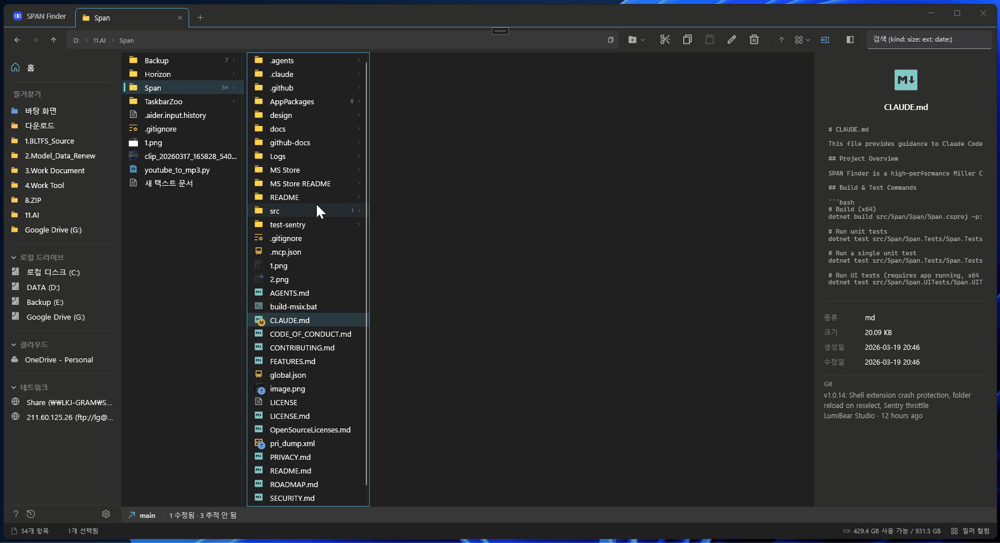
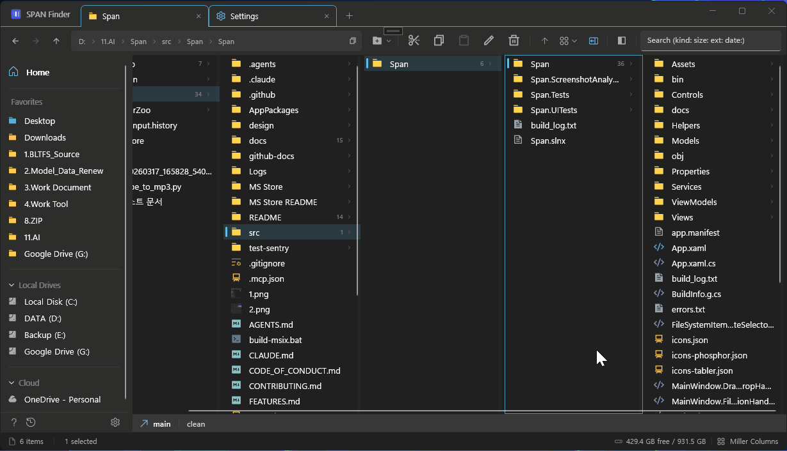
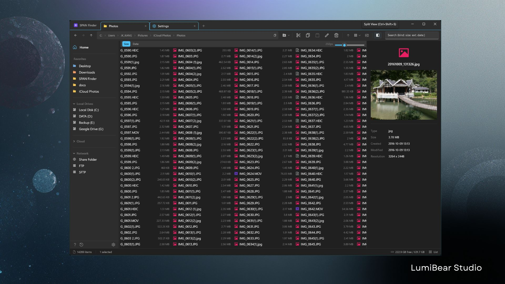
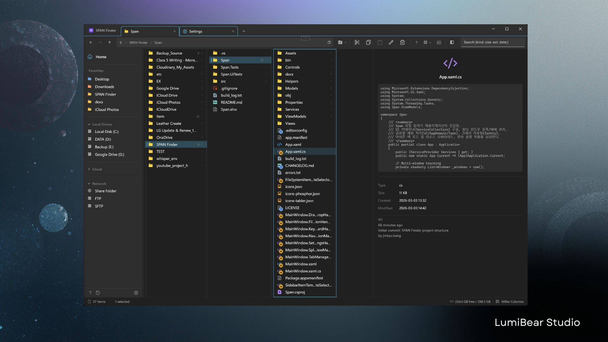
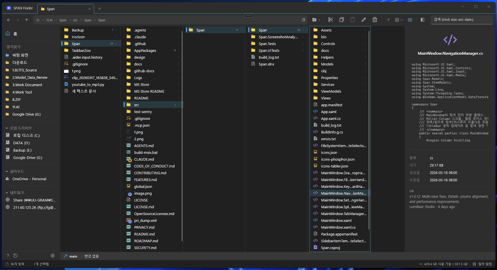
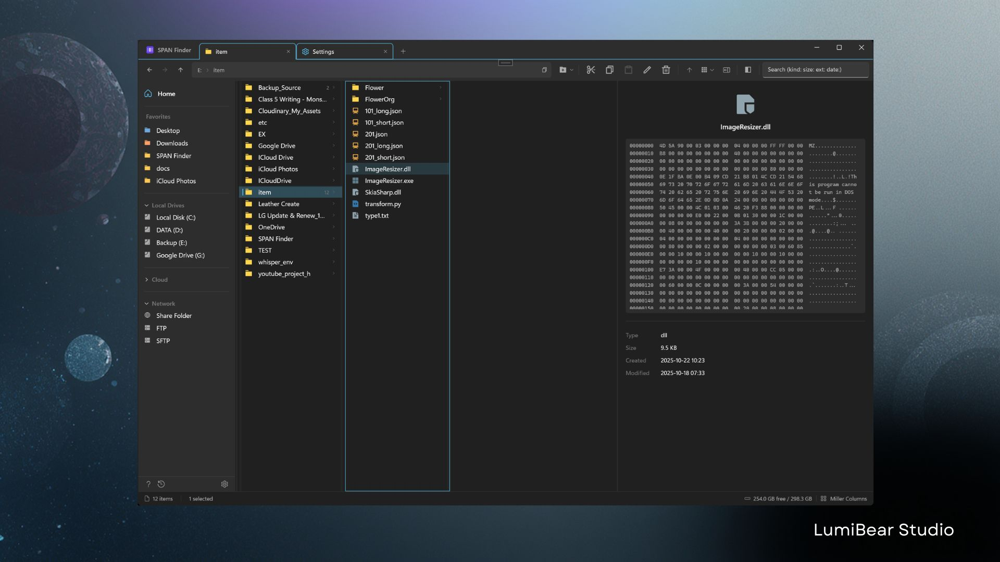

<h1 align="center">
  SPAN Finder
</h1>

<p align="center">
  <strong>Die Miller Columns von macOS Finder, jetzt auf Windows.</strong><br>
  Fuer alle, die zu Windows gewechselt haben, aber die Spaltenansicht des Finder nicht aufgeben koennen.
</p>

<p align="center">
  <a href="https://apps.microsoft.com/detail/9P7NJ351X9TL"></a>
  <a href="https://github.com/LumiBearStudio/SpanFinder/releases/latest"></a>
  <a href="../LICENSE"></a>
  <a href="https://github.com/sponsors/LumiBearStudio"></a>
</p>

<p align="center">
  <a href="https://apps.microsoft.com/detail/9P7NJ351X9TL"></a>
</p>

<p align="center">
  <a href="../README.md">English</a> | <a href="README.ko.md">한국어</a> | <a href="README.ja.md">日本語</a> | <a href="README.zh-CN.md">中文(简体)</a> | <a href="README.zh-TW.md">中文(繁體)</a> | Deutsch | <a href="README.es.md">Español</a> | <a href="README.fr.md">Français</a> | <a href="README.pt.md">Português</a>
</p>

---



> **So sollte Ordnernavigation funktionieren.**
> Klicken Sie auf einen Ordner und sein Inhalt erscheint in der naechsten Spalte. Wo Sie sich befinden, woher Sie kamen und wohin Sie gehen — alles auf einen Blick. Kein Zurueck-Klicken mehr noetig.

---

## Warum SPAN Finder?

| | Windows Explorer | SPAN Finder |
|---|---|---|
| **Miller Columns** | Nicht vorhanden | Hierarchische Mehrspalten-Navigation |
| **Multi-Tab** | Nur Windows 11 (Basis) | Tab-Abreissen, Duplizieren, vollstaendige Sitzungswiederherstellung |
| **Geteilte Ansicht** | Nicht vorhanden | Dual-Panel mit unabhaengigen Ansichtsmodi |
| **Vorschau-Panel** | Basis | 10+ Typen — Bilder, Video, Audio, Code, Hex, Schriften, PDF |
| **Tastaturnavigation** | Eingeschraenkt | 30+ Shortcuts, Autovervollstaendigung, Tastatur-First-Design |
| **Batch-Umbenennung** | Nicht vorhanden | Regex, Praefix/Suffix, sequentielle Nummerierung |
| **Rueckgaengig/Wiederholen** | Eingeschraenkt | Vollstaendige Operationshistorie (konfigurierbare Tiefe) |
| **Benutzerdefinierte Themes** | Nicht vorhanden | 10 Themes — Dracula, Tokyo Night, Catppuccin, Gruvbox, Nord u.v.m. |
| **Git-Integration** | Nicht vorhanden | Branch, Status, Commits auf einen Blick |
| **Remote-Verbindungen** | Nicht vorhanden | FTP, FTPS, SFTP — Zugangsdaten gespeichert |
| **Arbeitsbereiche** | Nicht vorhanden | Tab-Layouts speichern & sofort wiederherstellen |
| **Cloud-Status** | Basis-Overlay | Echtzeit-Sync-Badges (OneDrive, iCloud, Dropbox) |
| **Startgeschwindigkeit** | Langsam bei grossen Verzeichnissen | Asynchrones Laden + Abbruch — keine Verzoegerung |

---

## Funktionen

### Miller Columns — Alles auf einen Blick

Navigieren Sie tiefe Ordnerhierarchien, ohne den Kontext zu verlieren. Jede Spalte repaesentiert eine Ordnerebene — klicken Sie auf einen Ordner und sein Inhalt erscheint in der naechsten Spalte. Sie sehen jederzeit, wo Sie sich befinden und wie Sie dorthin gelangt sind.

- Ziehbare Spaltentrennlinien zur Breitenanpassung
- Spalten gleichmaessig verteilen (Strg+Umschalt+=) oder an Inhalt anpassen (Strg+Umschalt+-)
- Sanftes horizontales Scrollen, damit die aktive Spalte immer sichtbar bleibt

### Vier Ansichtsmodi

- **Miller Columns** (Strg+1) — Hierarchische Navigation, das Markenzeichen von SPAN Finder
- **Details** (Strg+2) — Sortierbare Tabelle mit Name, Datum, Typ, Groesse
- **Liste** (Strg+3) — Kompaktes Mehrspaltenlayout fuer grosse Verzeichnisse
- **Symbole** (Strg+4) — Rasteransicht mit 4 Groessenstufen bis 256x256 Thumbnails



### Multi-Tab + Vollstaendige Sitzungswiederherstellung

- Unbegrenzte Tabs — jeder mit eigenem Pfad, Ansichtsmodus und Navigationsverlauf
- **Tab-Abreissen**: Tab in ein neues Fenster ziehen — Zustand bleibt vollstaendig erhalten
- **Tab-Duplizieren**: Tab mit exaktem Pfad und Einstellungen klonen
- Automatische Sitzungssicherung: App schliessen und wieder oeffnen — alle Tabs sind noch da

### Geteilte Ansicht — Echtes Dual-Panel

- Unabhaengige Links-Rechts-Navigation
- Verschiedene Ansichtsmodi pro Panel moeglich (links Miller, rechts Details)
- Individuelles Vorschau-Panel fuer jedes Panel
- Drag-and-Drop zwischen Panels zum Kopieren/Verschieben



### Vorschau-Panel — Vor dem Oeffnen sehen



**Leertaste** fuer Quick Look (macOS Finder-Stil):

- **Bilder**: JPEG, PNG, GIF, BMP, WebP, TIFF — Aufloesung und Metadaten
- **Video**: MP4, MKV, AVI, MOV, WEBM — Wiedergabesteuerung
- **Audio**: MP3, AAC, M4A — Kuenstler, Album, Dauer
- **Text & Code**: 30+ Dateierweiterungen — Syntaxhervorhebung
- **PDF**: Vorschau der ersten Seite
- **Schriften**: Glyphen-Beispiele + Metadaten
- **Hex-Binaer**: Roh-Byte-Ansicht fuer Entwickler
- **Ordner**: Groesse, Elementanzahl, Erstellungsdatum
- **Datei-Hash**: SHA256-Pruefsumme anzeigen + Ein-Klick-Kopie (in Einstellungen aktivierbar)

### Tastatur-First-Design

Ueber 30 Shortcuts fuer Nutzer, die die Haende nicht von der Tastatur nehmen:

| Shortcut | Aktion |
|----------|--------|
| Pfeiltasten | Spalten- und Elementnavigation |
| Eingabe | Ordner oeffnen oder Datei ausfuehren |
| Leertaste | Vorschau-Panel umschalten |
| Strg+L / Alt+D | Adressleiste bearbeiten |
| Strg+F | Suchen |
| Strg+C / X / V | Kopieren / Ausschneiden / Einfuegen |
| Strg+Z / Y | Rueckgaengig / Wiederholen |
| Strg+Umschalt+N | Neuer Ordner |
| F2 | Umbenennen (bei Mehrfachauswahl Batch-Umbenennung) |
| Strg+T / W | Neuer Tab / Tab schliessen |
| Strg+1-4 | Ansichtsmodus wechseln |
| Strg+Umschalt+S | Arbeitsbereich speichern |
| Strg+Umschalt+W | Arbeitsbereich-Palette oeffnen |
| Strg+Umschalt+E | Geteilte Ansicht umschalten |
| Entf | In den Papierkorb verschieben |

### Themes & Anpassung



- **10 Themes**: Light, Dark, Dracula, Tokyo Night, Catppuccin, Gruvbox, Solarized, Nord, One Dark, Monokai
- **6-stufige Zeilenhoehe** und **6-stufige Schrift-/Symbolgroesse** — unabhaengig einstellbar
- **10 Schriftarten**: Segoe UI Variable, Consolas, Cascadia Code/Mono, D2Coding, JetBrains Mono, Fira Code u.a. — CJK-Fallback-Schriftkette
- **3 Icon-Packs**: Remix Icon, Phosphor Icons, Tabler Icons
- **9 Sprachen**: Deutsch, English, 한국어, 日本語, 中文(简体/繁體), Español, Français, Português

### Entwickler-Tools



- **Git-Status-Badges**: Modified, Added, Deleted, Untracked pro Datei
- **Hex-Dump-Viewer**: Die ersten 512 Bytes als Hexadezimal + ASCII
- **Terminal-Integration**: Strg+` zum Oeffnen eines Terminals im aktuellen Pfad
- **Remote-Verbindungen**: FTP/FTPS/SFTP — verschluesselte Zugangsdaten

### Cloud-Speicher-Integration

- **Sync-Status-Badges**: Nur in der Cloud, Synchronisiert, Upload ausstehend, Wird synchronisiert
- **OneDrive, iCloud, Dropbox** automatisch erkannt
- **Intelligente Thumbnails**: Gecachte Vorschauen — keine unnoetige Downloads

### Intelligente Suche

- **Strukturierte Abfragen**: `type:image`, `size:>100MB`, `date:today`, `ext:.pdf`
- **Autovervollstaendigung**: In jeder Spalte tippen und sofort filtern
- **Hintergrundverarbeitung**: Die Suche blockiert die Benutzeroberflaeche nicht

### Arbeitsbereiche — Tab-Layouts speichern & wiederherstellen *(v1.2.1.0)*

- **Aktuellen Tab speichern**: Rechtsklick auf Tab -> "Tab-Layout speichern..." oder Strg+Umschalt+S
- **Sofort wiederherstellen**: Seitenleisten-Schaltflaeche Arbeitsbereiche oder Strg+Umschalt+W
- **Arbeitsbereiche verwalten**: Wiederherstellen, Umbenennen und Loeschen im Arbeitsbereich-Menue
- Ideal fuer Kontextwechsel — "Entwicklung", "Fotobearbeitung", "Dokumentenorganisation"

### Erweiterte Funktionen

- **Virtuelles Dateieinfuegen**: Dateien aus RDP-Remote-Sitzungen, Outlook-Anhaengen und anderen virtuellen Dateiquellen mit Strg+V einfuegen

---

## Leistung

Fuer Geschwindigkeit konzipiert. Getestet mit ueber 14.000 Elementen pro Ordner.

- Asynchrone I/O — blockiert den UI-Thread nicht
- Batch-Eigenschaftsaktualisierungen mit minimalem Overhead
- Entprellte Auswahl zur Vermeidung redundanter Arbeit bei schneller Navigation
- Caching pro Tab — sofortiger Tab-Wechsel ohne Neurendering
- Gleichzeitiges Thumbnail-Laden mit SemaphoreSlim-Drosselung

---

## Systemanforderungen

| | |
|---|---|
| **Betriebssystem** | Windows 10 Version 1903 oder hoeher / Windows 11 |
| **Architektur** | x64, ARM64 |
| **Laufzeit** | Windows App SDK 1.8 (.NET 8) |
| **Empfohlen** | Windows 11 fuer Mica-Hintergrund |

---

## Aus Quellcode bauen

```bash
# Voraussetzungen: Visual Studio 2022 + .NET Desktop + WinUI 3 Workloads

# Klonen
git clone https://github.com/LumiBearStudio/SpanFinder.git
cd SpanFinder

# Bauen
dotnet build src/Span/Span/Span.csproj -p:Platform=x64

# Unit-Tests ausfuehren
dotnet test src/Span/Span.Tests/Span.Tests.csproj -p:Platform=x64
```

> **Hinweis**: WinUI 3-Apps koennen nicht ueber `dotnet run` gestartet werden. Verwenden Sie **Visual Studio F5** (MSIX-Paketierung erforderlich).

---

## Mitwirken

Einen Fehler gefunden? Eine Funktionsanfrage? [Erstellen Sie ein Issue](https://github.com/LumiBearStudio/SpanFinder/issues) — jedes Feedback ist willkommen.

Build-Einrichtung, Coding-Konventionen und PR-Richtlinien finden Sie in [CONTRIBUTING.md](../CONTRIBUTING.md).

---

## Projekt unterstuetzen

Wenn SPAN Finder Ihnen nuetzlich ist:

- **[Auf GitHub sponsern](https://github.com/sponsors/LumiBearStudio)** — spendieren Sie einen Kaffee, einen Burger oder ein Steak
- **Geben Sie diesem Repository einen Star**, damit mehr Menschen es entdecken koennen
- **Teilen** Sie es mit Kollegen, die den macOS Finder vermissen
- **Melden Sie Fehler** — jeder Bug-Report macht SPAN Finder stabiler
- **[Im Microsoft Store herunterladen](https://apps.microsoft.com/detail/9P7NJ351X9TL)** — Store-Bewertungen helfen enorm bei der Sichtbarkeit

---

## Datenschutz & Telemetrie

SPAN Finder verwendet [Sentry](https://sentry.io) **ausschliesslich fuer Absturzberichte** — und Sie koennen es abschalten.

- **Was wir erfassen**: Ausnahmetyp, Stack-Trace, OS-Version, App-Version
- **Was wir NICHT erfassen**: Dateinamen, Ordnerpfade, Browserverlauf, persoenliche Daten
- **Keine Nutzungsanalyse, kein Tracking, keine Werbung**
- Alle Dateipfade in Absturzberichten werden vor dem Senden automatisch bereinigt
- `SendDefaultPii = false` — es werden keine IP-Adressen oder Benutzerkennungen erfasst
- **Deaktivierbar**: Einstellungen > Erweitert > "Absturzberichte" umschalten, um sie vollstaendig abzuschalten
- Der Quellcode ist offen — ueberpruefen Sie es selbst in [`CrashReportingService.cs`](../src/Span/Span/Services/CrashReportingService.cs)

Weitere Details finden Sie in der [Datenschutzerklaerung](../PRIVACY.md).

---

## Lizenz

Dieses Projekt steht unter der [GNU General Public License v3.0](../LICENSE).

**Microsoft Store-Ausnahme**: Der Urheberrechtsinhaber (LumiBear Studio) darf offizielle Binaerdateien gemaess den Microsoft Store-Bedingungen vertreiben. Diese Bedingungen gelten nicht als "zusaetzliche Einschraenkungen" im Sinne von GPL v3, Abschnitt 7. Diese Ausnahme gilt nur fuer die offizielle Verteilung und nicht fuer Forks von Drittanbietern.

**Markenzeichen**: Der Name "SPAN Finder" und das offizielle Logo sind Marken von LumiBear Studio. Forks muessen einen anderen Namen und ein anderes Logo verwenden. Die vollstaendige Markenrichtlinie finden Sie in [LICENSE.md](../LICENSE.md).

---

<p align="center">
  <a href="https://apps.microsoft.com/detail/9P7NJ351X9TL">Microsoft Store</a> ·
  <a href="../PRIVACY.md">Datenschutzerklaerung</a> ·
  <a href="../OpenSourceLicenses.md">Open-Source-Lizenzen</a> ·
  <a href="https://github.com/LumiBearStudio/SpanFinder/issues">Fehler melden & Funktionswuensche</a>
</p>
